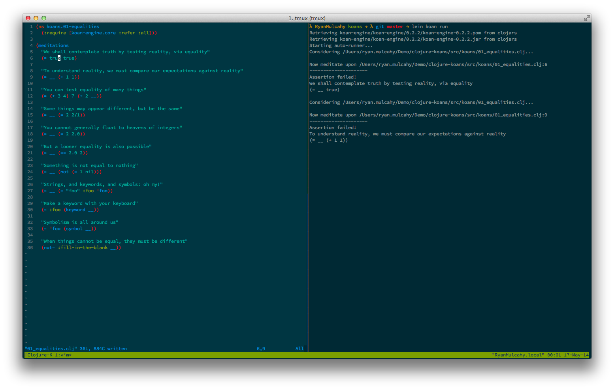
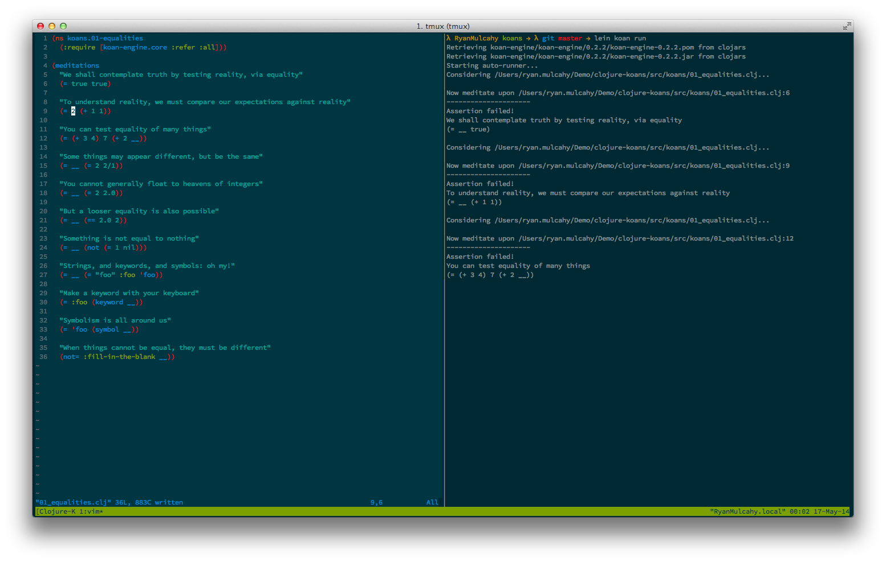

Lightning Talk: clojurekoans
============================

What the heck is a koan?

  - A koan is a story, dialogue, question, or statement, which is used in Zen-practice to provoke the "great doubt", and test a student's progress in Zen practice.

How does this relate to learning clojure?
  
  - Clojure Koans are short fill-in-the blank Clojure expressions that test your knowledge of Clojure and help you to learn!

Where do I get them?

  - http://clojurekoans.com/
        
        $ git clone git://github.com/functional-koans/clojure-koans.git

How do I run them?

  - From the 'koans' directory, 
        
        $ lein koan run
  - Then edit the file the runner is currently "meditating on" and when you save it, the Clojure Koans runner will pick up your changes!

### Back

Back to the [Curriculum](../README.md)
