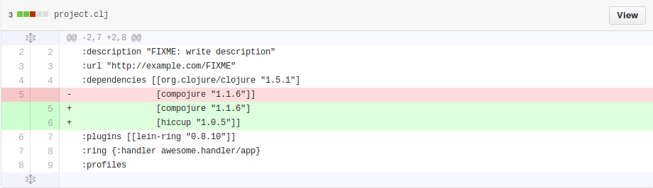
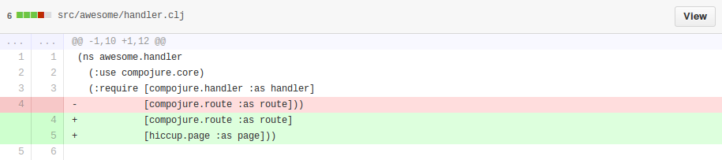

# Web App Notes


## Set up your app

```bash
lein new compojure chat
cd chat
lein ring server
```


This should create a directory structure that looks like this:

```
| .gitignore
| project.clj
| resources
| | public
| README.md
| target
| src
| | chat
| | | handler.clj
| test
| | chat
| | | test
| | | | handler.clj
```

There's nothing inherently special or Clojure-y about this project skeleton. It's just a convention used by Leiningen. You'll be using Leiningen to build and run Clojure apps, and Leiningen expects your app to be laid out this way. Here's the function of each part of the skeleton:

- `project.clj` is a configuration file for Leiningen. It helps
  Leiningen answer questions like, "What dependencies does this
  project have?" and "When this Clojure program runs, what function
  should get executed first?"
- `src/chat/handler.clj` is where we'll be doing our
  Clojure coding for awhile.
- The `test` directory contains tests, which we won't be covering.
- `resources` is a place for you to store assets like images; we won't
  be using it today.

Now let's go ahead and actually run this project. Enter this at the command line:

## Say hello to yourself

Open up your Chat application in LightTable. In LightTable open ```chat/src/chat.handler.clj```.

Change the ```(GET "/" ...``` line to say hello to yourself
```clojure
  (GET "/" [] "Hello YourName!")
```

View your page at http://localhost:3000/

[commit](https://github.com/clojurebridge-minneapolis/chat/commit/68695029d7933fc0272b4cd5d541ff9473db340b)


## Write some html with Hiccup

Under the ```(GET "/" ...``` line, add a new route like this:
```clojure
  (GET "/hello2" [] (page/html5 [:div "Hello from " [:b "hiccup"] "!"]))
```

If you save the file, you'll get an error in your console because Clojure doesn't know what Hiccup is yet. We'll need to add hiccup to our ```project.clj``` file and require it in ```src/chat/handler.clj```.
```clojure
; add this to the ```:dependencies``` section of project.clj
[hiccup "1.0.5"]
```
Because we've changed our ```project.clj``` file, you'll need to restart your server (press ```ctrl-c``` to stop it and then run the same command you ran before to start it again)

```clojure
; add this to the ```:require``` section at the top of handler.clj
[hiccup.page :as page]
```



View your page at http://localhost:3000/

[commit](https://github.com/clojurebridge-minneapolis/chat/commit/a5eb7cb2c6753cda053c716bc740fe6fdce5f9de)


## Add a form

Add a new item in ```:require```
```clojure
[hiccup.form :as form]
```

Add a new route for rendering a form that calls a function to make the page
```clojure
; add a function (Note: this must be before the defroutes section
(defn who []
  (page/html5
    (form/form-to [:post "/iam"]
                  [:label "Who are you?"]
                  (form/text-field "name")
                  (form/submit-button "Submit"))))

; add a route to the defroutes section
(GET "/who" [] (who))
```

View your page at http://localhost:3000/who. If you submit the form, you'll get an error, so we need to handle the post like this:
```clojure
; make a function to display our response
(defn iam [params]
  (page/html5
    [:div "You are " (:name params) "!"]))

; add a route to handle the request
(POST "/iam" {params :params} (iam params))
```

[commit](https://github.com/clojurebridge-minneapolis/chat/commit/fda95cd021e832f8230d7eded8240488fb80d89f)


## Add some flow control

```clojure
; change the iam function to look like this
(defn iam [params]
  (page/html5
    [:div "You are " (:name params) "!"
     [:ul
      [:li "Your name is " (if (odd? (count (:name params)))
                             "odd"
                             "even")]
      (when (> (count (:name params)) 7)
          [:li "You should consider a nickname."])]]))
```

[commit](https://github.com/clojurebridge-minneapolis/chat/commit/705227c000454f18c0f1ac7bba79bcf7f71e627a)


## Simplify things with ```let```

That's nice, but we've written ```(:name params)``` a lot. Change the function to use a ```var```:
```clojure
; change the iam function to look like this
(defn iam [params]
  (page/html5
    (let [name (:name params)]
      [:div "You are " name "!"
       [:ul
        [:li "Your name is " (if (odd? (count name))
                               "odd"
                               "even")]
        (when (> (count name) 7)
            [:li "You should consider a nickname."])]])))
```

[commit](https://github.com/clojurebridge-minneapolis/chat/commit/4bf28482e4b6c72bba1c6b635a1e30b2fd9f9879)


## Maps

We can look at our params map by printing it out. Change the ```iam``` function to this:
```clojure
; change the iam function to look like this
(defn iam [params]
  (page/html5
    (let [name (:name params)]
      [:div "You are " name "!"
       [:ul
        [:li (str params)]
        [:li "Your name is " (if (odd? (count name))
                               "odd"
                               "even")]
        (when (> (count name) 7)
            [:li "You should consider a nickname."])]])))
```

[commit](https://github.com/clojurebridge-minneapolis/chat/commit/9dcfa8cf5577c6fa65d7f8141d7788a5e56d1add)


## Post a name and message

```clojure
; change our default route to this (be sure to not leave the old version around - it will cause problems)
(ANY "/" {params :params} (chat (:name params) (:msg params)))

; add a chat function
(defn chat [name msg]
  (page/html5
   (form/form-to
    [:post "/"]
    [:div "Name:" (form/text-field "name" name) " Message:" (form/text-field "msg")]
    (form/submit-button "Submit"))))
```

View your app and submit a name and a message. Notice that the name is still there when you
submit the page.

[commit](https://github.com/clojurebridge-minneapolis/chat/commit/0af9ad31c50d8bd8552df759ec6dfdba35b7dbb7)


## Store and display messages

First, add an atom so we can store our messages somewhere.
```clojure
; above the chat function
(def messages (atom []))
```

Next, update our messages atom and print them out
```clojure
(defn chat [name msg]
  (when-not (empty? msg)
    (swap! messages conj [name msg]))
  (page/html5
    (map (fn [message] [:div [:strong (first message)] " " (second message)]) @messages)
    (form/form-to
      ; leave the rest of the function the same as it was..
```

Try using your app to chat with someone

[commit](https://github.com/clojurebridge-minneapolis/chat/commit/7350384b5f97dc618a4e81a175e8bfaf12c629e1)


## Make it pretty by adding Bootstrap

Add Bootstrap to our project by adding this dependency in your ```project.clj``` file:
```clojure
[hiccup-bootstrap "0.1.2"]
```
Don't forget to restart your server after making a change to ```project.clj```.

Add some code to make Bootstrap work in your ```src/chat/handler.clj``` file:
```clojure
; Add these two lines to use Bootstrap middleware. Put them at the top after the hiccup.form line:
[hiccup.bootstrap.middleware :as middleware]
[hiccup.bootstrap.page :as boot]

; modify our chat function to use Bootstrap
(defn chat [name msg]
  (when-not (empty? msg)
    (swap! messages conj [name msg]))
  (page/html5
   [:head                         ;added
    [:title "Chat"]                         ;added
    (boot/include-bootstrap)]               ;added
   [:body                                   ;added
     [:h1 "Chat"]                           ;added
     (map (fn [message] [:div [:strong (first message)] " " (second message)]) @messages)
     (form/form-to
      [:post "/"]
      [:div "Name:" (form/text-field "name" name) " Message:" (form/text-field "msg")]
      (form/submit-button "Submit"))]))     ;changed

; add the Bootstrap specific routes by wrapping our routes with them
(def app
  (handler/site (middleware/wrap-bootstrap-resources app-routes)))
```

[commit](https://github.com/clojurebridge-minneapolis/chat/commit/a518836ff9b7e0016d006051fd88dd707ffcdbe7)
